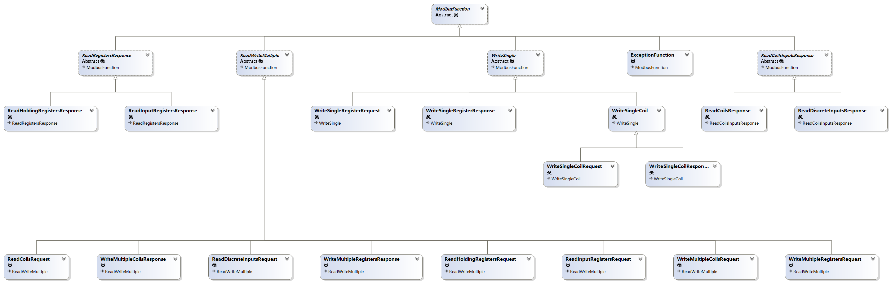

# Modbus TCP

Modbus TCP client/server implementation in C# with DotNetty.

A port of [modjn](https://github.com/klymenek/modjn).

## Currently implemented modbus functions

+ 0x01: Read Coils
+ 0x02: Read Discrete Inputs
+ 0x03: Read Holding Registers
+ 0x04: Read Input Registers
+ 0x05: Write Single Coil
+ 0x06: Write Single Register
+ 0x0F: Write Multiple Coils
+ 0x10: Write Multiple Registers

## ModbusFunction Class Diagram:

## Blog

[开源 DotNetty 实现的 Modbus TCP/IP 协议](https://www.cnblogs.com/victorbu/p/10342552.html)
